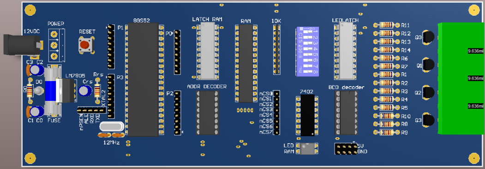
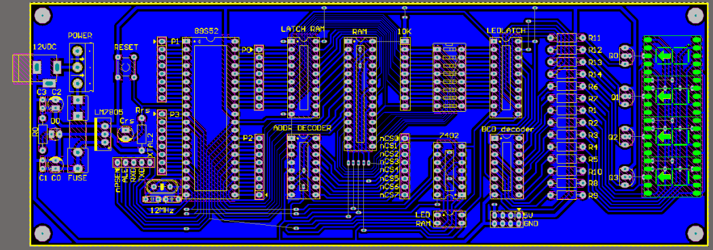
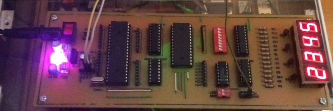
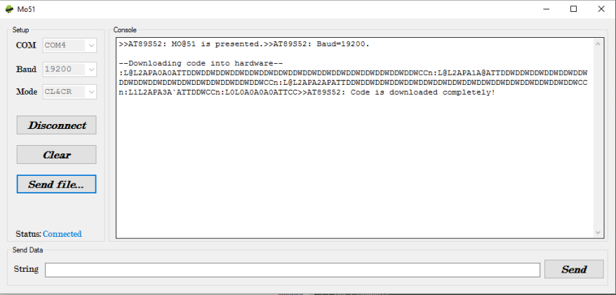

# MO-51: 8051 Monitoring Program
A system is operated by Monitoring program to RAM to store user code instead of built-in ROM of 8051 micro-controller.

# I. Description
This project is our course **Microcontroller**'s project at University of Technology. In this project, we design an embedded system made up of 8051-based hardware and it's firmware, software. 
* We implement a circuit including 8051 microcontroller and its peripherals such as 4 7-seg LEDs, RAM, and external communication ports.
* A firmware called monitoring program written in C was designated to function as Operating System. It stored in ROM, whenever the circuit is plugged in, it will look for user application code and store it in external RAM before making it run.
* Software is a program of number counting and led chasing written in C.
# II. Members
* [Thuy Ng](https://github.com/AntiAegis): **Leader, firmware designer**
* [Phuong Le](https://github.com/PhuongLeVanHoang): **Hardware and Software designer**
-----
# III. Result
**Schematic**

**Circuit**

**Demo**

**Window application**

